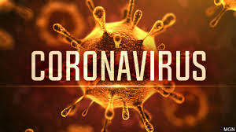

## Changes to my lifestyle
Before the enforced lock-down has happened in Hawaii in light of COVID-19 concerns, I never expected that COVID will be such an issue to the lifestyle of my family, my friends, and myself. To be quite fair, I don't think most of the college students expected this COVID outbreak to be a huge deal in Hawaii since we never had any cases for a while. Then we had one case, and we exponentially grew in COVID cases. My daily routine consisted of going to school, going to the gym, coming home, studying/doing homework, and maybe playing some games. Even changes to how much toilet paper I used changed! Now that classes changed to online classes and that social distancing is enforced, everything is done at home and I don't even have to leave the house. The latter part is something I like, except for the fact that now I can't go to the UH gym and do my weekly workout routine. This was frustrating for me because I recently started going and enjoyed going to the gym. But now that I can't go, it messed up my healthy lifestyle. Currently, I mostly stay at home on my computer and barely get any exercise unless I force myself to do so. I can't casually hang out with my friends, or go to the gym, and meeting my professors face to face isn't possible anymore. I do enjoy having online classes but overall I think it messed up my daily routine.\

## Different learning experience
In the past, I have taken one online course from Leeward Community College, and it felt quite nice having to simply watch a video lecture and turn in weekly homework. The issue with this is that if I don't understand something or have questions, I couldn't meet face to face with my professor. COVID has drastically impacted my ability to learn because I think that there is a very large difference when it comes to learning in a physical class setting versus online classes. For example, when you have physical classes to go to, you need to be present to learn and work out problems. For online classes, everything changes because it is up to you to make sure you are learning what you need to learn, and to finish any tasks that you need to finish. This type of learning isn't my type of learning because I am very lazy and when it comes to motivation, I sometimes lack the motivation to learn things on my own. That's why when I have to drive to UH to learn and go to classes, that is my motivation to learn since it forces me to go to class. I feel like I was learning a lot more when I was going to physical class settings before than I am now through online classes, which I think is terrible and hate COVID for causing it.

## Moving forward
Moving forward from this coronavirus pandemic, I think I need to make a lot of changes to my values, lifestyle, and goals. I think that before this coronavirus pandemic, I never really cared much about how the family is doing since we all mostly went about our daily routines without thought. Now that COVID is a thing and the cases in Hawaii are growing rapidly, I worry for my family members that go to work out in public since they can be exposed to the virus. 
I used to think that going to classes and learning was something that I had to do, and in particular, was forced to do. Now that all of my classes are online, I now realize that my classes are there only to teach, and it is up to me to take what I get to learn and push myself to grow. Without the motivation to do anything myself, I will never get anywhere, and that has become apparent to me during these times.
