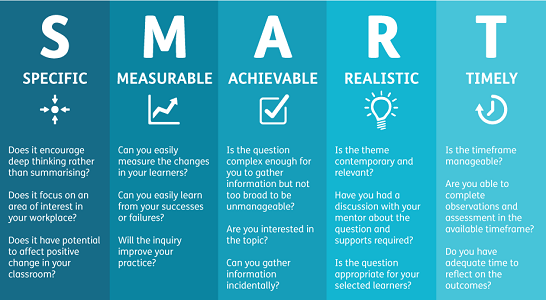

## Smart Questions
When I initially heard about learning how to ask "smart" questions, I thought that it was referring to the saying that there are no dumb questions. What I realized is that in the open-source community though, there are indeed dumb and smart questions! I never knew about the many parts that come together to create smart questions. Eric Raymond in [How to ask questions the smart way](http://www.catb.org/esr/faqs/smart-questions.html) taught me the things I should do before asking, and the important aspects that a smart question has. I think that it is really important for all software engineers to know what a smart and dumb question is, and in particular, how to create smart questions and making it a habit.

## A Not-So-Smart Question from a Loser
One of the things that Raymond characterizes as a loser, that is asking a not-so-smart question, is that they haven't prepared, researched, or thought very extensively about their problem. An example of a not-so-smart question from stack overflow can be found [here](https://stackoverflow.com/questions/60000660/textoverflow-ellipsis-in-widget-text-not-work), where the person shows all of the code and only states that they got a specific error. To me, this counts as a not so thoughtful question because it begins with a code block about 30 lines long. It also does not state a lot of information about the code and what the person did to try to solve the problem. For example, the person did not state things that he/she researched to try to find the solution, and the person simply does not give enough background about the code. It may be a little good that they stated some kind of error, but nothing else.

## A Smart Question from a Winner
Reading an example of a smart question from a software engineer on stack overflow shows me the differences between smart question and not-so-smart questions just by the clarity, and the quality of answers it provides. [This](https://stackoverflow.com/questions/11227809/why-is-processing-a-sorted-array-faster-than-processing-an-unsorted-array) question on stack overflow asks about why a sorted array processes faster than an unsorted array. The person makes his/her question clear, shows their code, and breaks down the steps they took before reaching the question that they have. You can tell that this is a smart question because they specify specific questions at the end of their post using bullet points, it provides detail about what the person is thinking in terms of the question itself, and shows that the person cares about the idea behind the question, and that they are capable of learning from the answers that this question provides.
