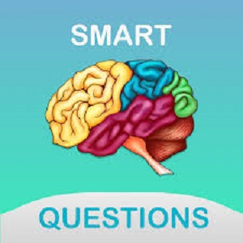

---
layout: essay
type: essay
title: Difficult but easier?
# All dates must be YYYY-MM-DD format!
date: 2020-02-27
labels:
  - Software Engineering
  - UI Frameworks
  - Semantic UI
  - ICS 314
--- 

## What are these frameworks?
UI frameworks are useful when you want to write compact code that is easier to write and read. The one drawback to using a UI framwork is that you have to learn how to use it first! This was evident when I was first learning how to use Semantic UI on an online learning website called [pluralsite](https://app.pluralsight.com/library/). For me it was just like learning a new programming language because of the new coding syntaxes I needed to learn. For example, we still used `div`s but the classes we use might include code such as `ui`, `container`, or `menu`. I could definitely see why it is recommended that software engineers use UI framworks because compared to how long it might take to build a code from scratch, you can simply use the framwork in order to quickly recreate what you need, or want to create.

## What it's like learning a UI framework
For me, learning new code is the same process as learning anything else in life: read, watch, and practice. For some reason though, Semantic UI has been quite hard to learn because it is hard for me to memorize the new coding syntax with their specific functionalities; for example knowing to use a `ui action input` class to create an input box that will perform an action or using a `ui two column grid` class in order to create a grid section that will have two columns each row. I have been working on writing html code and css styling code for a while, and learning how to utilize Semantic UI has been fun because you get to see exactly what you want when you run the code; especially because Semantic UI's coding makes for a rather straight forward coding layout.

## A Smart Question from a Winner

