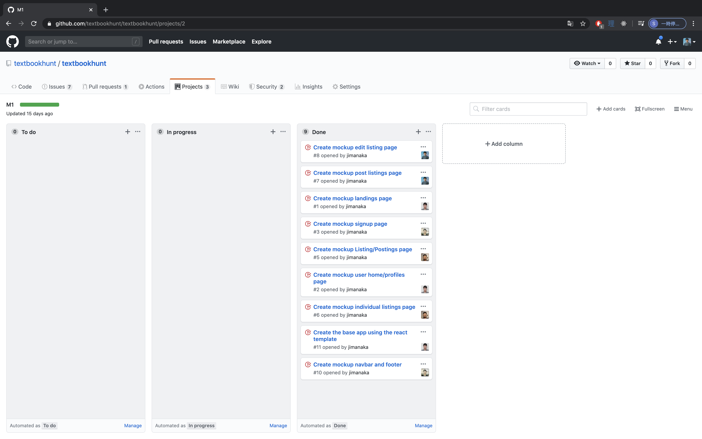

---
layout: essay
type: essay
title: Software Engineering Fundamentals
# All dates must be YYYY-MM-DD format!
date: 2020-05-13
labels:
  - Software Engineering
  - User Interface Frameworks
  - Agile Project Management
  - ICS 314
--- 

## Learning basic software engineering
For this 314 class, I was more or less expecting to learn about the basics of software engineering since we would be doing web application development throughout the course. I was pleased to figure out that I was wrong since we acquired experience with fundamental software engineering concepts such as Agile Project Management, which is an iterative approach to planning and guiding project processes, and User Interface Frameworks, which are frameworks created for user interface applications. I realized that software engineering is comprised of more than just web application development or likewise. Many fundamental concepts go behind software engineering which will help elevate one's code and work in the software engineering industry.

## Learning about User Interface Frameworks
During my 314 class, we learned about User Interface Frameworks, particularly web UI frameworks, and I enjoyed creating web applications through the use of UI (web) frameworks. It was very difficult learning how to use UI frameworks because it was just like learning a new type of code. But I soon realized that it was worth trying to learn and invest my time in learning it because, in the end, UI frameworks help me create web applications a lot easier and saves me a lot of time. One UI (web) framework that I used was Semantic UI, which took me a while to learn and get used to using. I enjoyed using Semantic UI because I was able to create web applications with more ease than if I were to create them without any help/kick-start. I learned about the luxuries of being able to use UI frameworks while also figuring out their cons.

## The important Agile Project Management
It was said that for this course and quite possibly for the rest of my career, Agile Project Management might just be the most important thing I will learn. This is because I learned of a style of Agile Project Management called Issue Driven Project Management during my final project for this ICS 314 class. For my final project, my team and I created a web application for selling textbooks, and to keep things organized and efficient for group work on a group project, we had to utilize Issue Driven Project Management to keep our development flowing. I enjoyed the idea of Issue Driven Project Management because each issue is solvable individually without having to be held back by other issues. I think this is brilliant because it maintains the flow of development of a single group project, and helps provide more clarity as to what specific issues need to be solved. I can see myself using this type of project management for a lot of things and not just web development. For example, since I love playing video games competitively, working on my muscle memory by having multiple issues to solve is one way I would incorporate Issue Driven Project Management into my gaming.

