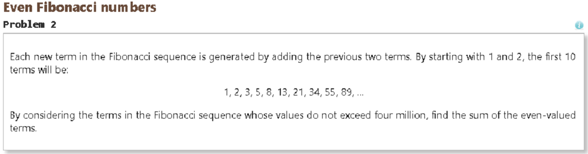

## First Week
Before I came into this 314 class, I had no knowledge on javascript; I only knew C/C++ and Java. Hearing the word Javascript made me think that it must be similar to java because *it has java in it*! Perhaps I wasn't totally wrong because like I was told on the first day of class: It is just another language that you learn. I can see how someone that has learned other languages might be able to pick up Javascript fast because Javascript, to me, is kind of similar. I don't think that Javascript is all that hard from the initial code I learned from free code camp. It felt just like learning any other language. When I learned Java, I didn't have much issues, it's just that I had to engrave these new concepts in me that I never knew about before. Same with javascript because you could say it is similar but it is also completely different.

## How good is Javascript? 
Coming from just a week of studying and learning Javascript, I can say that it is quite interesting to use. I feel that C/C++ and Java are similar in that there are variables types, but in Javascript, you can simply write `let` or `const` and even simply use `var` to represent a global variable. I think it is very convenient to be able to do this because as we discussed in one of our 314 classes, you can notice that in Javascript, a function has no return value, therefore can return a string or anything else really. And like any other language, there are conventional coding styles in Javascript, and I think that is simply just a part of the process when learning a new language. 

## The real workout
One thing that I think is very effective in learning a new language is the practice WODs we have during class and outside of class. I think this is very important and every ICS class that teaches a new language should implement this style of learning because a lot of times, when a class is learning a new language, they don't get to apply what they learned to the fullest extent. Therefore they won't learn as much as they would compared to if they were to do practice WODs. I do think WODs are important in the learning process but it is very stressful for me even if I am confident in the material because writing code under stress is very nerve-racking for me and sometimes that causes me to blank-out and forget the material. In the end I think that it will work out for me because the best way for me to learn something new is to constantly apply and use it.

