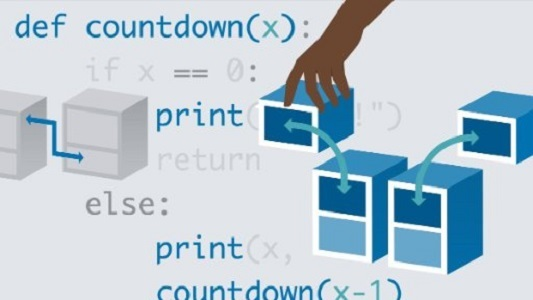

## Looking Back
One of the biggest reasons why I decided to go into majoring in Computer Science is because I love to play video games. The core of creating a video game, whether it be super advanced or simple, lies in code. What I truly wish to accomplish by going to college and studying ICS, is to be able to atleast make my own video game that many other people can also play and enjoy. I think that by the end of my 4 years at the University of Hawaii at Manoa, I will be able to accomplish this goal, and maybe even make my career involved with games.

## Expectations vs. Reality
Something I expected to learn right off the bat when coming into college as a Computer Science student was to already learn the ability to write code that is usable in the real world. I should have expected the exact opposite because right now, it is *basics*, *basics*, *basics*. I can't make good code in the future if my foundation is not good in the first place. I think that applies to a lot of new topics, but especially for ICS students learning languages and ideas. This is why I hope to develop a lot of skills in the future that I can utilize during my career in the working industry. I want to gain a lot of knowledge through experience such as on-hand programming and more.

## Glad to be here
A topic that is quite often heard is about someone dropping out of a major or getting sick of their major. For me, I love technology and being able to learn so much about how technology works and learning of *behind-the-scenes* material for software keeps me hooked and interested. I noticed that one habit that I have is that if I have an interest in something, I want to atleast get good at it before I take a break or learn something new. With Computer Science, it applies, but because there is just so much information and so many ideas I have still not yet learned, I don't think that I will ever stop wanting to learn new things; in the present, and in the future.

