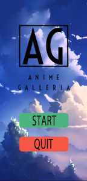
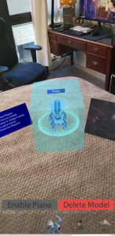

Anime Galleria is a gallery of anime and game related figures that are displayed using augmented reality. The main functionality of the application is to allow the user to control which figure is displayed by choosing through a UI bar that is scrollable and dragging them out. When a figure is chosen, it will display the model of the character, along with its name, a short description, and a video that the user can press to play/pause. Another feature of the application is that the user can scale and transform the model and when they are done looking at the display, they can delete the character from the screen and a particle effect is shown. 

Throughout this project, I was responsible with most of the designing aspect of the application and creating prefabs for the models being displayed. Much of the issues we faced with this project was with the creation of the models using photogrammetry.  We had problems with the models not forming properly, which was most likely due to bad lighting and smooth surfaces. Some figures that were originally planned to be used as a photogrammetry model were not possible to be done, so we decided to have Derek create models for us.
    

**Demo video of code for the project:**

