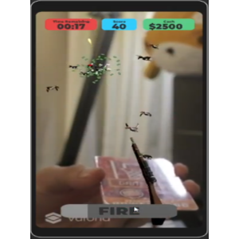

Duck Hunt AR is an augmented reality game that takes inspiration from the NES game Duck Hunt. For this project, we used unity to code the game and implemented vuforia for the AR functionalities. The core of the game is to utilize image targets, which could be something like a gift card, and displaying things on the phone screen. By controlling the gun attached to the card, you can shoot the ducks and UFOs that are flying around on the screen. Successfully shooting down ducks and UFOs grants the player points and the goal is to get as many points as possible within the time limit.

For this game, I was mostly in charge of the spawns and making sure that the movement of the ducks and UFOs were random. I also was in charge of implementing the score tracking UI and setting up the point system for the game. For the game, I wanted the UFOs to be rare, therefore I made the amount of health, score, and cash higher for UFOs. In order to make the game harder as time goes on, I also added a script to increase the speed of ducks and UFOs based on a timer associated with the time remaining.

In this augmented reality project, we faced a lot of issues such as trying to keep the play area static, relative to the environment. My group was also new to vuforia development, so it was difficult for the transition gameplay from an emulator in unity to an actual mobile device. I think that I learned more about scripts and coding in unity. It was interesting learning about how image targets work for augmented reality and I would like to attempt another project involving augmented reality.

**Demo video of code for the project:**

