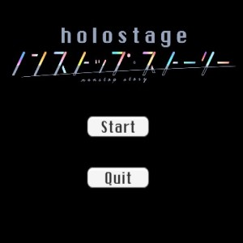
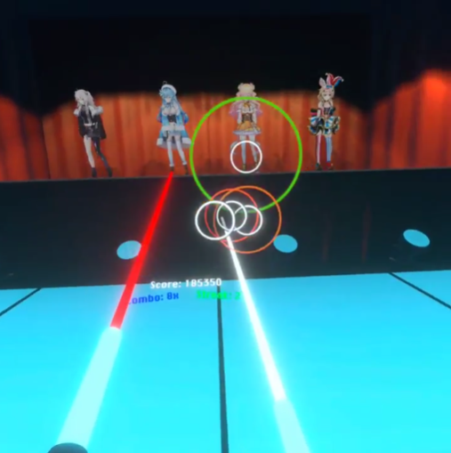

Holostage - Nonstop Story was one of the first main projects we had to do for this ICS 486 class. For this project, we had to use unity in order to create a virtual reality application that is playable using the Oculus Quest. One of my group members and I were in charge of working on the functionality and coding, while one student in our group was responsible for creating the models and animations.

In this project, I was in charge of implementing the score tracker for the game, along with creating a complimentary streak and combo tracker. In addition to the score tracking, I implemented a scoring system that gives the player a letter grade based on their final score. The final score screen is displayed when the song is finished, and this screen includes buttons for redirecting the player to retry, go to the main menu, or quit.

This was the first time I ever created a project through unity and I had to learn more about C# as I coded for the game. This game was fun to create because I enjoyed being able to recreate something that is similar to osu and beat saber but in VR. The toughest problems throughout the project were with hit registration and making sure that when the player gets the point if their light beam is inside the circle at the correct times. We were able to somewhat figure it out by increasing the window of time for the beam and the circle to register a hit. 

**Demo video of code for the project:**

