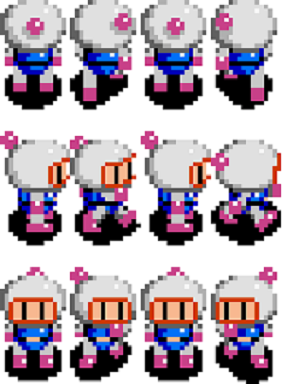

This project was about showcasing our ability to utilize the EZ library and basic java coding to create a more advanced game than the previous projects we've created. For our project, my partner Jake and I decided to try to make a copy of the game *Bomberman* since Bomberman is one of my favorite games to play. We decided that it was possible to create at least some kind of game that represents a Bomberman game.

In this project of ours, my role was taking care of the sprite sheet and making sure that the code for utilizing the sprite sheet is functional. I would say that creating the animations was quite a large part of the project, but Jake did create the base game functionality with the breaking of the blocks, placing bombs, and explosions. It was difficult creating the sprite sheet for this project and using it because I had issues aligning the sprite sheet and the game. For example, when the user moves right, I have to focus on one spot of the sprite sheet, but that's hard to do if not everything is scaled properly since some animations might have parts of another animation, which would cause issues.

Working with Jake, I learned a lot more about the EZ library and how to utilize its functions. I also learned a lot myself about how sprite sheets work and I realized that it is not easy to do in a short amount of time. I also learned that it is possible to create makeshift games in a short amount of time if you dedicate yourself to programming it. I started to realize how important it is to have at least one more person working on the same code that you are because they can help point out issues that you might have in your code, and working with another person might help you accomplish greater tasks. I think that this is very important in real-life situations because most of the time if I am coding for a large company, I will most likely be working with other programmers and we can work together to finish advanced jobs.

**Demo video of code for the project:**

