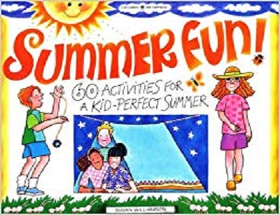

  

The Summer Fun program is a recreational program for children aged 5-11 where they will have various activities to do while in the program such as sports, arts and crafts, music and dance, and more. The Summer Fun program at my local recreation center consisted of 7 groups and I had responsibility over the oldest aged group: group 7.

During the course of the summer program, my role was to be the leader for group 7 and to supervise them. As a leader, I was responsible for making sure that the City and County's goal of *adding quality to life* was being met. That means that I was required to make sure that the children in my group were not bored and were having fun every day of the program. I was mostly responsible only for my group of kids, but because the whole summer program is just broken into smaller groups, we are essentially still responsible for other kids in the program that might not be in our group. Making sure that I come up with activities to do on days we don't have excursions/activities was important. I also had to make sure the kids were not fighting or bullying each other, and that they were safe.

I learned a lot from this experience working as a leader because I think one of my biggest strengths is being able to follow directions from a leader, and being the leader for a change was difficult to get used to. I used to volunteer as a junior leader, assisting leaders in their work, so I never had a lot of responsibilities. Now that I had to work as a leader and make sure that the kids were having fun, it taught me a lot about thinking outside the box when I am on the spot; such as figuring out what the kids would like to play on free-time when I didn't prepare beforehand. When I was stuck on thinking about activities to do, I was able to ask my coworkers for help and they would give me hints or suggestions and I would be able to come up with something based off of their answers. What I learned was that I really enjoyed working with the kids but I also learned how valuable it is to prepare for something when it is required. Having to come up with an activity that we have not done before, on the spot, was really difficult, and having an agenda really helped on the days I needed it.

You can learn more about the Summer Fun program at the [Department of Parks and Recreation Website](http://www.honolulu.gov/parks/program/summer-fun-program.html).

