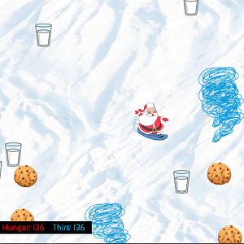

This ICS 111 project was mostly focused on the students using the knowledge they just gained on the uses of images and *hit-boxes*. The point of the project was to use the EZ library and Java to create a sort of mini-game that has a side-scrolling background image and the game should utilize hit-boxes to determine health and thirst levels. We also learned how to implement sound files into a Java program which is shown in this project.

In this project, I was responsible for making all of the code to make the minigame all by myself. I was responsible for getting all of the images and sound files that make up the game. Because we just recently learned how to make image boxes and hit detection, I was able to look at lecture note codes and write my code for the program to make it run as best as it can. One thing that I did was create my tornadoes and made sure that my background image looked as seamless as possible since it is looping and sidescrolling.

Making this project, I learned just how amazing code is when making, for example, a side-scrolling game. The concept of a background image being placed like bricks one after another to create a seamless flowing image felt very satisfying and accomplishing to create. I also learned a lot more about hit detection and this is cool for me because I play a lot of video games that rely on hit detection and being able to create a really simple case of hit detection was very enlightening.

**Demo video of the project:**

