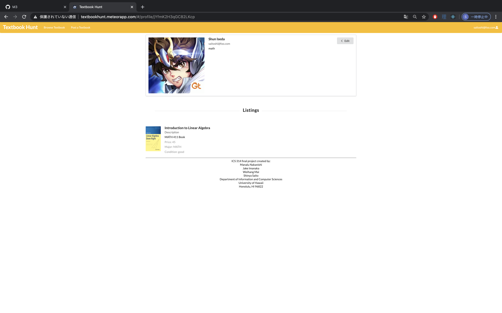

This project was about showcasing our ability to utilize web development tools to create a web application made with a user interface so that people can interact with our website. For our project, my group and I decided to make a meteor application which allows for UH students with a market of used textbooks. They will be able to sell and purchase textbooks from other users.

In this project of ours, my role was taking care of a few issues per milestone for the project. I mostly focused on creating the issues for the issue-driven project management that was taking place for this project. We had over 10 issues per milestone for a total of three milestones, each milestone increasing the complexity of the application. For the first milestone, I created two pages, one of which was the page in which lists all of the textbooks being sold, and the second page was a mock-up page for an individual listing of a textbook. For the second milestone, I was responsible for allowing users to delete their posts and styling and editing the sign in and sign up page. For the third milestone, I was responsible for adding confirmations to any submissions and editing profiles.

Working with my team on this final project, I learned a lot about Issue Driven Project Management because the whole system relied upon each of us doing our issues for the project to further progress the web application. I enjoyed having a team to work on for this final project because we would have meetings when we were creating new milestones to create issues that we all agree on, and working on those issues by ourselves and asking questions when we needed it was a new experience for me. It felt like a makeshift real-life work setting for me, and that was interesting in itself. 

[Link to the Github for the project](https://textbookhunt.github.io/)

